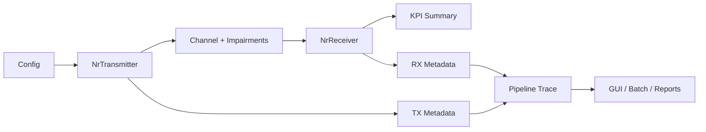

# 5G NR PHY STL Developer Guide

## 1. Purpose

This guide is for developers working on the codebase itself.

It explains:

- repository structure
- runtime architecture
- how data flows through the simulator
- how to add or modify PHY stages safely
- how to validate changes
- how packaging, CI/CD, and releases are expected to work

This is not an end-user operations document. For installation and normal usage, see [USER_MANUAL.md](USER_MANUAL.md).

## 2. Project Positioning

The current project should be treated as:

`software-only, link-level, visually inspectable 5G NR PHY simulator`

Current maturity:

- `P0`: complete
- `P1`: complete
- `P2`: complete at baseline level
- `P3`: complete at baseline level
- `P4+`: roadmap work

Current implemented scope includes:

- standard-faithful SISO baseline
- downlink and uplink baseline chains
- `PRACH`, `PBCH / SSB`, `PDCCH/CORESET/SearchSpace` baseline support
- `DM-RS`, `PT-RS`, `CSI-RS`, `SRS`
- SU-MIMO baseline with:
  - `1-2 codewords`
  - `1-4 layers`
  - `2x2` and `4x4`
  - `identity`, `dft`, and `type1_sp` precoding baseline
  - `ZF`, `MMSE`, `OSIC`
  - `CQI / PMI / RI` CSI loop baseline
- `P3` HARQ / scheduler baseline with:
  - HARQ process state
  - NDI tracking
  - RV sequencing
  - rate-recovered LLR soft combining
  - DCI-like grant replay
  - scheduler-driven `harq_process_id`, `NDI`, `RV`, MCS, layer, and precoder selection

## 3. Architectural References

Before changing major PHY behavior, read:

- [NR_PHY_SIMULATOR_V2_ARCHITECTURE.md](NR_PHY_SIMULATOR_V2_ARCHITECTURE.md)
- [NR_PHY_SIMULATOR_V2_BACKLOG.md](NR_PHY_SIMULATOR_V2_BACKLOG.md)
- [TECHDOC_5G_NR_PHY_TRACE.md](TECHDOC_5G_NR_PHY_TRACE.md)
- [GUI_ARCHITECTURE.md](GUI_ARCHITECTURE.md)

These documents define the intended direction of the codebase. Changes that fight those documents tend to create architectural drift.

## 4. Repository Map

### 4.1 Top-Level Layout

| Path | Role |
| --- | --- |
| [main.py](../main.py) | main entry point for single-run CLI and GUI |
| [run_experiments.py](../run_experiments.py) | batch experiment entry point |
| [phy](../phy) | baseband PHY blocks and PHY-adjacent procedures |
| [channel](../channel) | channel and impairment models |
| [experiments](../experiments) | orchestration and batch logic |
| [gui](../gui) | PyQt/pyqtgraph GUI and Dash integration |
| [utils](../utils) | IO, validation, plotting, file transfer helpers |
| [configs](../configs) | scenario and default runtime configs |
| [tests](../tests) | unit, regression, GUI smoke, scenario tests |
| [docs](../docs) | technical and user-facing documentation |
| [pyproject.toml](../pyproject.toml) | package metadata and build config |
| [.github/workflows](../.github/workflows) | CI/CD definitions |

### 4.2 Important Modules

| Module | Responsibility |
| --- | --- |
| [phy/transmitter.py](../phy/transmitter.py) | TX chain, metadata, OFDM modulation |
| [phy/receiver.py](../phy/receiver.py) | RX chain, estimation, detection, decoding |
| [phy/resource_grid.py](../phy/resource_grid.py) | RE allocation, layer/port/RX grids, masks |
| [phy/coding.py](../phy/coding.py) | CRC, segmentation, coding, rate matching/recovery |
| [phy/layer_mapping.py](../phy/layer_mapping.py) | layer-domain mapping helpers |
| [phy/precoding.py](../phy/precoding.py) | precoders and codebook baseline |
| [phy/mimo_detection.py](../phy/mimo_detection.py) | `ZF`, `MMSE`, `OSIC` detectors |
| [phy/csi.py](../phy/csi.py) | CSI feedback estimation and selection |
| [experiments/common.py](../experiments/common.py) | run orchestration, slot history, pipeline contract |
| [gui/phy_pipeline.py](../gui/phy_pipeline.py) | stage model construction and stage rendering |

## 5. Runtime Architecture

### 5.1 Execution Paths

There are three main execution paths:

1. `Single-run CLI`
2. `GUI single-run / multi-slot playback`
3. `Batch experiment`

All three should share the same PHY core. Do not fork behavior unnecessarily.

### 5.2 High-Level Flow



### 5.3 Core Contract

The runtime contract is:

- TX produces waveform + metadata
- channel produces received waveform + channel state
- RX produces recovered bits + artifacts + KPIs
- orchestrator produces:
  - single result
  - optional multi-slot history
  - normalized pipeline stages

The GUI should consume normalized artifacts, not infer semantics from arbitrary dict keys.

## 6. Data Model and Tensor Domains

The simulator is now tensor-aware.

Key domains:

- `codeword`
- `layer`
- `port`
- `tx_ant`
- `rx_ant`
- `symbol`
- `subcarrier`

Important structures:

- [types.py](../phy/types.py)
  - `SpatialLayout`
  - `TensorViewSpec`
- [context.py](../phy/context.py)
  - `SlotContext`
- [artifacts.py](../phy/artifacts.py)
  - pipeline-stage artifact schema

Developer rule:

- new spatial features must be added in a tensor-consistent way
- avoid introducing new SISO-only side paths unless explicitly intended as compatibility shims

## 7. Configuration Model

Primary runtime configuration is driven from [configs/default.yaml](../configs/default.yaml), then optionally overridden by scenario files.

Validation is centralized in [validators.py](../utils/validators.py).

Developer rule:

- if a new config knob affects runtime behavior, it must be:
  - added to `default.yaml`
  - validated in `validate_config`
  - documented in relevant docs
  - reflected in GUI controls if user-facing

## 8. How the GUI Consumes Runtime Data

### 8.1 GUI Split

Main GUI modules:

- [app.py](../gui/app.py)
- [controls.py](../gui/controls.py)
- [plots.py](../gui/plots.py)
- [phy_pipeline.py](../gui/phy_pipeline.py)
- [dashboard.py](../gui/dashboard.py)

### 8.2 Pipeline Contract

The GUI expects stage entries with stable fields such as:

- `key`
- `section`
- `flow_label`
- `title`
- `description`
- `metrics`
- `artifacts`
- `artifact_type`
- `input_shape`
- `output_shape`
- `notes`

Developer rule:

- if you add a new PHY block, also add a corresponding GUI stage if the block is meant to be inspectable
- do not overload an unrelated stage just to avoid adding a new one

## 9. Adding a New PHY Block

Use this workflow.

### 9.1 Step 1: Decide the Domain

Identify whether the block operates in:

- bit domain
- symbol domain
- layer domain
- port domain
- antenna domain
- grid domain
- waveform domain

This determines:

- input/output types
- artifact type
- where the block belongs in the pipeline

### 9.2 Step 2: Add the Processing Logic

Preferred locations:

- `phy/` for PHY blocks
- `channel/` for channel/RF/impairment behavior
- `experiments/` only for orchestration

### 9.3 Step 3: Extend Metadata and Result Contracts

If the block produces runtime data needed later:

- add it to TX metadata or RX result
- keep names explicit and domain-oriented

Examples:

- `tx_layer_symbols`
- `tx_port_symbols`
- `effective_channel_tensor`
- `decoder_input_llrs`

### 9.4 Step 4: Add GUI Stage

If the block should be visible:

- add a stage in [gui/phy_pipeline.py](../gui/phy_pipeline.py)
- expose meaningful metrics
- expose at least one artifact

Preferred artifact types:

- `bits`
- `llr`
- `constellation`
- `grid`
- `waveform`
- `line`
- `bar`
- `text`

### 9.5 Step 5: Add Tests

At minimum:

- one unit or regression test in [tests](../tests)
- if GUI stage is added, one GUI smoke test
- if scenario behavior changes, one scenario-level smoke test

### 9.6 Step 6: Update Docs

At minimum:

- README link or scope note if user-visible
- architecture/backlog docs if it changes roadmap expectations

## 10. Testing Strategy

### 10.1 Test Categories

The suite currently mixes:

- unit tests for small helpers
- regression tests for PHY flows
- GUI smoke tests
- scenario tests

### 10.2 Main Command

```powershell
python -m pytest -q
```

### 10.3 When to Run What

- small local refactor:
  - targeted test file first
- cross-cutting PHY change:
  - full suite
- packaging / release work:
  - full suite + build

### 10.4 High-Risk Areas

Changes in these files usually require broader regression:

- [phy/transmitter.py](../phy/transmitter.py)
- [phy/receiver.py](../phy/receiver.py)
- [phy/resource_grid.py](../phy/resource_grid.py)
- [experiments/common.py](../experiments/common.py)
- [gui/phy_pipeline.py](../gui/phy_pipeline.py)

## 11. Packaging

Package metadata is defined in:

- [pyproject.toml](../pyproject.toml)
- [MANIFEST.in](../MANIFEST.in)

Version source:

- [fivegnr_phy_stl/__init__.py](../fivegnr_phy_stl/__init__.py)
- [pyproject.toml](../pyproject.toml)

Developer rule:

- keep both versions synchronized
- do not cut a release with mismatched package metadata and Git tag

Build command:

```powershell
.\.venv\Scripts\python.exe -m build
```

## 12. CI/CD

GitHub Actions live under [.github/workflows](../.github/workflows).

Current pipelines cover:

- test / compile validation
- package build
- release assets
- container publishing workflow

Developer rule:

- if a new workflow depends on a new tool or artifact, document that dependency in repo docs
- avoid CI steps that only work on one developer machine

## 13. Release Workflow

Recommended release sequence:

1. ensure working tree is clean
2. run full tests
3. build package
4. confirm version strings
5. push `main`
6. create GitHub release with matching tag

For milestone releases, summarize:

- roadmap phase closed
- major features added
- validation evidence
- package artifacts

## 14. Branching and Commit Discipline

Use small commits with technical boundaries.

Good examples:

- `Add MIMO detection baseline`
- `Expose CSI feedback stage in GUI`
- `Add two-codeword SU-MIMO regression tests`

Avoid mixing:

- large doc rewrites
- runtime logic
- packaging changes
- unrelated GUI tweaks

in one commit unless they are inseparable for correctness.

## 15. Documentation Discipline

The repo now has both user-facing and developer-facing docs.

Recommended split:

- `README.md`
  - entry-level overview
  - quickstart
  - links to deeper docs
- `USER_MANUAL.md`
  - operation
  - scenarios
  - troubleshooting
- `DEVELOPER_GUIDE.md`
  - internal architecture
  - extension workflow
  - packaging / CI / release
- architecture / backlog docs
  - strategic direction

Developer rule:

- do not let README absorb everything
- move sustained technical detail into targeted docs

## 16. Known Design Constraints

Even after the `P3` baseline, the simulator still has intentional limits:

- HARQ is a teaching/research baseline, not a full 3GPP MAC HARQ implementation
- the scheduler is grant-replay based, not a dynamic QoS/BSR/CQI-driven MAC scheduler
- no MU-MIMO
- no Massive MIMO
- no FR2 hybrid beamforming

This matters because contributors should not accidentally describe the repo as feature-complete 5G NR.

## 17. Recommended Next Work

After `P3`, the next correct development target is `P4`.

Priority order:

1. MU-MIMO user model
2. user grouping and per-user grants
3. interference-aware precoding
4. CSI-RS/SRS-driven multi-user channel observations
5. HARQ process scheduling across users

Only after that should the repo move into:

- Massive MIMO
- FR2 / hybrid beamforming

## 18. Developer Checklist

Before merging a nontrivial change, confirm:

- config validated
- runtime contract updated
- GUI artifacts updated if relevant
- tests added or updated
- docs updated
- package still builds
- release/version metadata unchanged unless intentionally updated

## 19. Related Documents

- [README.md](../README.md)
- [USER_MANUAL.md](USER_MANUAL.md)
- [NR_PHY_SIMULATOR_V2_ARCHITECTURE.md](NR_PHY_SIMULATOR_V2_ARCHITECTURE.md)
- [NR_PHY_SIMULATOR_V2_BACKLOG.md](NR_PHY_SIMULATOR_V2_BACKLOG.md)
- [TECHDOC_5G_NR_PHY_TRACE.md](TECHDOC_5G_NR_PHY_TRACE.md)
- [GUI_ARCHITECTURE.md](GUI_ARCHITECTURE.md)
