# NR PHY Simulator V2 Architecture

## 1. Purpose

This document defines the target architecture for evolving the current project from a `downlink-centric, single-layer, observability-first PHY workbench` into a `standard-faithful, software-only, link-level 5G NR PHY simulator` with strong GUI introspection.

The target is not a full 5G system simulator. The target is a link-level PHY simulator that models realistic NR PHY structures, supports MIMO and CSI-driven processing, and remains inspectable stage-by-stage through the GUI.

## 2. Design Goal

The correct end-state for this repository is:

`software-only, link-level, standard-faithful, visually inspectable NR PHY simulator`

This means:

- keep the project focused on PHY and PHY-adjacent procedures
- implement the parts of NR that materially affect waveform generation, reference signals, channel estimation, detection, decoding, HARQ behavior, and CSI-driven adaptation
- stop short of pretending to be a full RAN/core simulator

The project should interoperate conceptually with system-level simulators such as:

- [5G-LENA](https://cttc-lena.gitlab.io/nr/html/)
- [Simu5G](https://simu5g.org/index.html)

## 3. 3GPP Anchor

The architecture in this document is grounded in the following NR specifications and reports:

- [3GPP 38-series overview](https://www.3gpp.org/dynareport?code=38-series)
- [TS 38.211](https://www.etsi.org/deliver/etsi_ts/138200_138299/138211/18.02.00_60/ts_138211v180200p.pdf): physical channels, signals, numerology, resource grid, layer mapping, antenna ports, precoding, OFDM
- [TS 38.212](https://www.etsi.org/deliver/etsi_ts/138200_138299/138212/18.02.00_60/ts_138212v180200p.pdf): CRC, segmentation, LDPC, Polar, rate matching, RV
- [TS 38.213](https://www.etsi.org/deliver/etsi_ts/138200_138299/138213/18.03.00_60/ts_138213v180300p.pdf): control procedures, HARQ-ACK behavior, PDCCH monitoring, random access
- [TS 38.214](https://www.etsi.org/deliver/etsi_ts/138200_138299/138214/18.02.00_60/ts_138214v180200p.pdf): PDSCH/PUSCH procedures, MCS, TBS, CSI reporting, PMI/RI/CQI, codebooks
- [TR 38.901](https://www.etsi.org/deliver/etsi_tr/138900_138999/138901/18.01.00_60/tr_138901v180100p.pdf): TDL/CDL channel models, antenna arrays, spatial consistency, blockage, MIMO evaluation assumptions

These references define what "more realistic NR PHY" means for this repository.

## 4. Current State Assessment

Based on the current codebase:

- [`phy/transmitter.py`](../phy/transmitter.py) emits one waveform and one metadata object for one stream.
- [`phy/receiver.py`](../phy/receiver.py) operates on one corrected waveform, one RX grid, one channel estimate, and one equalized stream.
- [`phy/resource_grid.py`](../phy/resource_grid.py) models a single-slot, single-grid abstraction.
- [`channel/fading_channel.py`](../channel/fading_channel.py) applies one impulse response and one frequency response, not a MIMO channel tensor.

The current project is therefore:

- single-layer
- effectively SISO
- downlink-centric
- observability-first
- suitable for teaching and stage tracing
- not yet representative of realistic NR PHY behavior under SU-MIMO, MU-MIMO, or massive MIMO

## 5. Target Scope

### 5.1 In Scope

- standard-faithful NR link-level PHY behavior
- downlink and uplink PHY
- HARQ and rate recovery
- SU-MIMO and then MU-MIMO
- beam-oriented CSI and codebook-driven operation
- realistic channel and impairment modeling
- GUI-driven inspection at codeword, layer, port, antenna, RE, symbol, slot, and frame levels

### 5.2 Out of Scope

- full MAC/RLC/PDCP/RRC implementation
- core-network simulation
- mobility management and handover orchestration
- gNB scheduler realism at system level
- multi-cell traffic engineering and QoS studies

Those belong in a system simulator or in a separate bridge layer.

## 6. Architectural Principles

1. **Tensor-first data model**
   - Do not extend the current scalar/vector flow ad hoc.
   - Make all PHY data structures explicit in terms of codewords, layers, ports, antennas, symbols, and subcarriers.

2. **Separation of concerns**
   - Separate waveform generation, channel modeling, receiver inference, control procedures, and GUI artifact generation.

3. **Two runtime profiles**
   - `Teaching mode`: simplified, fast, highly visual.
   - `Standard mode`: more 3GPP-faithful, slower, more suitable for validation.

4. **Software-only by design**
   - The target remains SITL/software-only.
   - SDR/HIL support can be added later, but must not distort the core architecture.

5. **Validation-driven implementation**
   - Every major block must have an acceptance test and an expected artifact.

## 7. Target PHY Processing Model

### 7.1 Downlink

```mermaid
flowchart LR
    A["MAC TB / File payload"] --> B["TB CRC"]
    B --> C["Code block segmentation + CB CRC"]
    C --> D["LDPC / Polar coding"]
    D --> E["Rate matching + RV"]
    E --> F["Scrambling"]
    F --> G["QAM mapping"]
    G --> H["Codeword to layer mapping"]
    H --> I["Precoding / antenna port mapping"]
    I --> J["Resource mapping: PDSCH/PDCCH/PBCH + DM-RS/PT-RS/CSI-RS/SSB"]
    J --> K["OFDM / CP / TX RF impairments"]
    K --> L["MIMO channel tensor"]
    L --> M["RX sync / CFO / timing"]
    M --> N["Remove CP + FFT + RE extraction"]
    N --> O["Channel estimation + MIMO detection"]
    O --> P["Soft demap + descrambling + rate recovery"]
    P --> Q["LDPC / Polar decode + CRC"]
    Q --> R["HARQ-ACK / CSI"]
```

### 7.2 Uplink

```mermaid
flowchart LR
    A["UL-SCH / UCI / PRACH payload"] --> B["CRC + coding"]
    B --> C["Rate matching"]
    C --> D["Scrambling"]
    D --> E["QAM"]
    E --> F["Layer mapping"]
    F --> G["Transform precoding (optional)"]
    G --> H["Precoding / port mapping"]
    H --> I["PUSCH/PUCCH/PRACH/SRS mapping + DM-RS/PT-RS/SRS"]
    I --> J["OFDM or DFT-s-OFDM"]
    J --> K["MIMO channel tensor"]
    K --> L["gNB sync + FFT + RE extraction"]
    L --> M["CE + detection + descrambling + rate recovery"]
    M --> N["Decode + CRC + HARQ state update"]
```

## 8. Tensorized Data Model

The V2 simulator should standardize on the following tensor forms.

| Domain | Shape | Meaning |
| --- | --- | --- |
| `tb_bits` | `tb[n]` or `tb[user, n]` | transport block bits |
| `coded_bits` | `cw[cw, n]` | coded bit stream per codeword |
| `layer_symbols` | `layer[layer, re]` | modulation symbols per layer |
| `port_grid` | `port[port, symbol, sc]` | resource grid per antenna port |
| `tx_waveform` | `tx_ant[tx_ant, sample]` | time-domain waveform per TX chain |
| `channel` | `H[rx_ant, tx_ant, symbol, sc]` | frequency-domain MIMO channel tensor |
| `rx_waveform` | `rx_ant[rx_ant, sample]` | received time-domain waveform |
| `rx_grid` | `rx_ant[rx_ant, symbol, sc]` | per-antenna FFT grid |
| `detected_layers` | `layer[layer, re]` | post-detection layer symbols |
| `llr` | `cw[cw, n]` | soft decoder input per codeword |
| `harq_buffer` | `proc, cw, n` | HARQ soft combining buffer |

This tensorization is the key refactor. Without it, MIMO support will remain superficial.

## 9. Module Decomposition

The target codebase should be decomposed into modules with stable interfaces.

### 9.1 Waveform and Grid Modules

- `phy/waveform/ofdm.py`
- `phy/grid/resource_grid.py`
- `phy/grid/re_extraction.py`
- `phy/reference_signals/dmrs.py`
- `phy/reference_signals/ptrs.py`
- `phy/reference_signals/csi_rs.py`
- `phy/reference_signals/srs.py`
- `phy/reference_signals/ssb.py`

### 9.2 Coding and HARQ

- `phy/coding/crc.py`
- `phy/coding/segmentation.py`
- `phy/coding/ldpc_nr.py`
- `phy/coding/polar_nr.py`
- `phy/coding/rate_matching.py`
- `phy/coding/rate_recovery.py`
- `phy/harq/process_manager.py`
- `phy/harq/soft_buffer.py`

### 9.3 Spatial Processing

- `phy/mimo/layer_mapping.py`
- `phy/mimo/precoding.py`
- `phy/mimo/codebooks.py`
- `phy/mimo/detection.py`
- `phy/mimo/layer_recovery.py`
- `phy/mimo/beam_management.py`
- `phy/mimo/csi_reporting.py`

### 9.4 Channel and RF

- `channel/tdl.py`
- `channel/cdl.py`
- `channel/array_response.py`
- `channel/spatial_consistency.py`
- `channel/blockage.py`
- `rf/tx_frontend.py`
- `rf/rx_frontend.py`

### 9.5 Control Procedures

- `procedures/pdcch.py`
- `procedures/pdsch.py`
- `procedures/pusch.py`
- `procedures/pucch.py`
- `procedures/prach.py`
- `procedures/ssb_pbch.py`

## 10. Runtime Profiles

### 10.1 Teaching Mode

- reduced parameter space
- deterministic defaults
- simplified but explicit artifacts
- lower slot counts
- emphasis on stage-by-stage visualization

### 10.2 Standard Mode

- more faithful coding and procedures
- proper HARQ state
- realistic RE signaling
- realistic CSI loops
- configurable MIMO layers and ports
- heavier channel modeling

Both profiles must reuse the same data model. Only fidelity and runtime cost should differ.

## 11. GUI Evolution

The GUI should remain a differentiator of this repository.

### 11.1 Pipeline Upgrade

The current `PHY Pipeline` should evolve from:

`Bits -> CRC -> Coding -> ... -> CRC Check`

to:

`Codeword -> Layer -> Port -> TX Array -> Channel Tensor -> RX Array -> Detector -> Codeword`

### 11.2 New Screens

- `Per-layer constellation`
- `Per-port grid`
- `Array/beam pattern`
- `CSI-RS / SRS occupancy`
- `CQI/PMI/RI timeline`
- `HARQ process timeline`
- `MU interference matrix`
- `Beam sweep heatmap`
- `Detector diagnostics`

### 11.3 Artifact Contract

Every processing block should declare:

- input tensor shape
- output tensor shape
- scalar metadata
- GUI artifact type
- validation expectations

## 12. Validation Strategy

Validation must be explicit at three levels.

### 12.1 Unit Validation

- bit-exact CRC behavior
- segmentation logic
- rate matching and recovery inversion
- symbol mapping and demapping
- port mapping and RE extraction correctness

### 12.2 Link-Level Validation

- BLER versus SNR trends
- channel estimation quality
- equalizer and detector behavior
- HARQ improvement over retransmissions
- CSI-driven adaptation trends

### 12.3 Cross-Reference Validation

Use external references selectively:

- [Sionna PHY](https://nvlabs.github.io/sionna/phy/) for research-oriented oracle comparisons
- [MathWorks 5G Toolbox](https://www.mathworks.com/products/5g.html) for commercial-reference waveform behavior
- [5G-LENA](https://cttc-lena.gitlab.io/nr/html/) and [Simu5G](https://simu5g.org/index.html) for system-level alignment only

## 13. Completion Criteria

The repository should not be described as "realistic NR PHY" until all of the following exist:

- standard-faithful SISO downlink
- standard-faithful uplink chain
- HARQ with soft combining
- SU-MIMO `2x2` and `4x4`
- CSI with `CQI/PMI/RI`
- `CSI-RS`, `SRS`, and `PT-RS`
- array-aware TDL/CDL channel support
- GUI artifacts for layer/port/array/detector domains

## 14. Recommended Positioning

Recommended public positioning:

`A software-only, link-level, standard-faithful NR PHY simulator with deep GUI introspection for teaching, experimentation, and staged evolution toward MIMO, HARQ, and CSI-aware operation.`

This is the right identity for the project. It preserves the strengths of the current codebase while giving it a technically coherent path toward realistic 5G NR PHY behavior.
