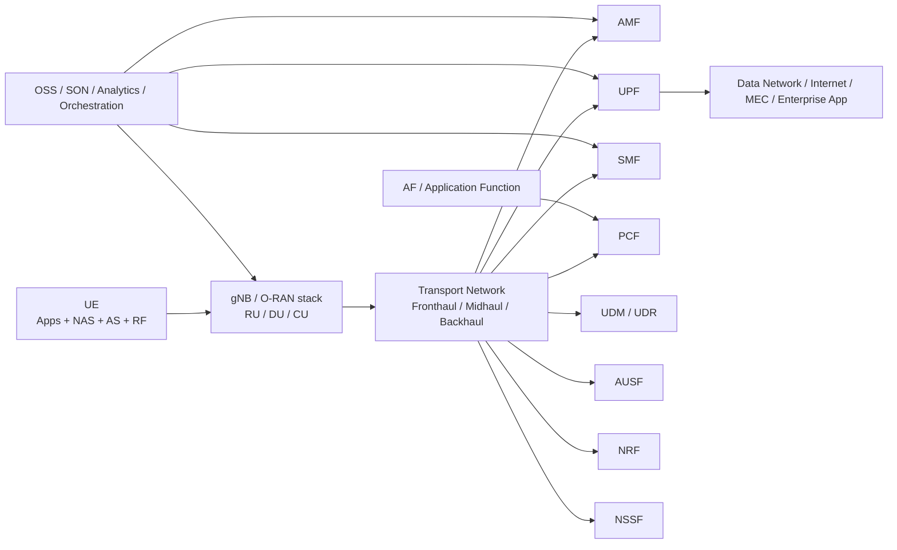
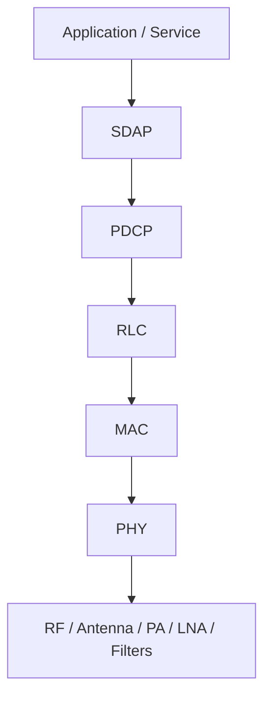
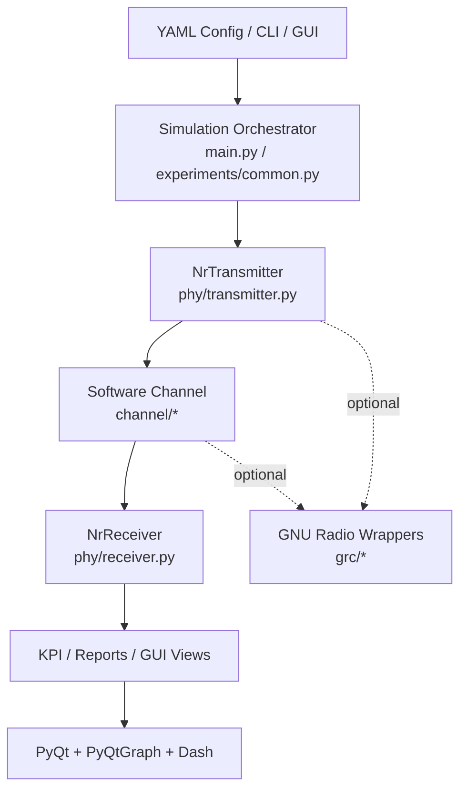
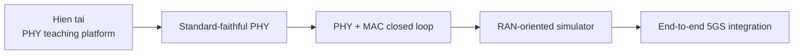
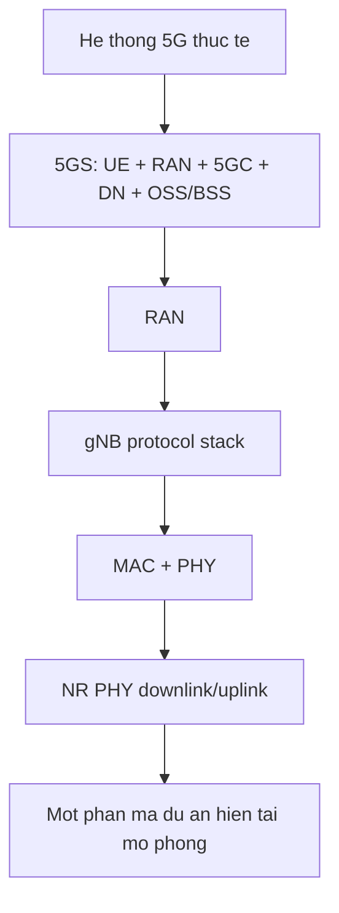

# He thong 5G thuc te hien nay va doi chieu voi du an 5G NR PHY STL

## Tom tat

Tai lieu nay tra loi cau hoi trung tam: **mot he thong 5G thuc te nam 2026 gom nhung gi, va du an `5G NR PHY STL Research Platform` da mo phong duoc den dau trong buc tranh do**.

Ket luan ngan gon:

- 5G thuc te la mot **he thong dau-cuoi** gom UE, RAN, transport, 5G Core, application domain, OSS/BSS, orchestration, bao mat, quan ly QoS, mobility, slicing va van hanh mang.
- Du an hien tai la mot **downlink-oriented PHY workbench** theo huong `3GPP-inspired`, software-only, phu hop cho nghien cuu, giang day, va prototyping link-level.
- Du an da lam tot cac khoi cot loi cua PHY: OFDM, resource grid, DMRS, AWGN/fading/impairments, equalization, demapping, KPI, GUI stage-by-stage.
- Du an **chua** la he thong 5G day du va chua phai PHY conformance-grade: thieu phan MAC/RLC/PDCP/RRC/NAS/5GC, thieu scheduler/HARQ dong o muc MAC day du, thieu MU-MIMO/Massive-MIMO/beam management, uplink hoan chinh, initial access day du, va coding chua dung 3GPP bit-true.
- Ve gia tri hoc thuat, du an nay rat manh o vai tro **teaching/research platform**; ve muc do sat he thong 5G thuong mai, no nen duoc xem la **mot mo hinh PHY pilot/co so** thay vi mot stack NR day du.

## 1. Pham vi va phuong phap doi chieu

### 1.1. Nguon noi bo du an da doc lai

Tai lieu nay duoc tong hop tu chinh ma nguon va tai lieu trong repo, dac biet la:

- [`README.md`](../README.md)
- [`phy/transmitter.py`](../phy/transmitter.py)
- [`phy/receiver.py`](../phy/receiver.py)
- [`phy/coding.py`](../phy/coding.py)
- [`phy/resource_grid.py`](../phy/resource_grid.py)
- [`phy/numerology.py`](../phy/numerology.py)
- [`channel/fading_channel.py`](../channel/fading_channel.py)
- [`channel/impairments.py`](../channel/impairments.py)
- [`experiments/common.py`](../experiments/common.py)
- [`gui/phy_pipeline.py`](../gui/phy_pipeline.py)
- [`gui/controls.py`](../gui/controls.py)
- [`configs/default.yaml`](../configs/default.yaml)
- [`configs/channel_profiles.yaml`](../configs/channel_profiles.yaml)
- [`configs/mcs_tables.yaml`](../configs/mcs_tables.yaml)

### 1.2. Nguon doi chieu ben ngoai

De mo ta "he thong 5G thoi diem hien tai", tai lieu nay su dung:

- 3GPP Release 18 page va bai viet stage-3 completion cua 3GPP
- 3GPP Release 19 page
- GSMA Mobile Economy 2025 va GSMA 5G spectrum/public policy paper

### 1.3. Cach doc tai lieu nay

Tai lieu tach ro ba lop so sanh:

1. **5G nhu mot he thong thuc te**
2. **NR PHY nhu mot subsystem vo tuyen**
3. **Du an nay dang mo phong duoc bao nhieu trong subsystem do**

Noi cach khac, tai lieu khong hoi "du an nay co phai 5G that khong", ma hoi:

- no giong 5G that o dau
- no khac 5G that o dau
- khoang cach ky thuat con lai la gi

## 2. Snapshot 5G thuc te nam 2026

### 2.1. 5G hien nay dang o giai doan nao trong 3GPP

Bang sau tong hop buc tranh cap nhat tu 3GPP:

| Release | Vai tro trong 5G | Trang thai/chu y nghien cuu | Y nghia doi voi du an nay |
| --- | --- | --- | --- |
| Release 15 | Nen tang 5G NR/5GC ban dau | Moc khoi dau cua 5G thuong mai | Du an bam vao logic NR ban dau nhieu nhat |
| Release 16 | Tang cuong URLCC, IAB, positioning, cong nghiep | Da la mot phan quan trong cua 5G truong thanh hon | Du an chua cham den phan lon tinh nang nay |
| Release 17 | Mo rong NTN, RedCap, multicast/broadcast, nang cap positioning | 5G da vuot khoi eMBB co ban | Du an chua bao phu |
| Release 18 | 5G-Advanced phase 1 | 3GPP cong bo stage-3 completion ngay 10/04/2024 | Du an chua o muc 5G-Advanced |
| Release 19 | 5G-Advanced phase 2 | 3GPP page Release 19 nam 2026 mo ta la "second phase of 5G-Advanced" | Du an chua nham toi muc nay |

Nhan xet ky thuat:

- Khi noi "5G thuc te hien nay", ta khong con dung lai o Rel-15 nua.
- He thong 5G thuong mai va ecosystem hien nay dang chuyen tu `5G initial deployment` sang `5G-Advanced`.
- Vi vay, mot PHY simulator chi mo phong PDSCH/PDCCH co ban se moi phan anh **lop logic cot loi Rel-15/Rel-16-inspired**, chua phan anh toan bo he thong 5G nam 2026.

### 2.2. 5G thuong mai hien nay trong thuc te trien khai

Tu cac tai lieu GSMA moi:

| Chi bao | Gia tri/nhan dinh tu nguon cong khai | Y nghia |
| --- | --- | --- |
| So ket noi 5G toan cau | GSMA neu 5G vuot `2 billion connections` vao cuoi nam 2024 | 5G da o quy mo dai chung, khong con la pilot |
| Do bao phu thi truong | GSMA ghi nhan 5G co mat o `more than 100 countries`; tinh den thang 6/2024 co `295 operators in 114 markets` da launch 5G thuong mai | He thong thuc te can tinh den deployment heterogeneity, spectrum va ops |
| Benchmark khu vuc | GSMA cong bo ngay 15/01/2025 rang 5G chiem `30%` ket noi di dong tai chau Au vao cuoi 2024, so voi `24%` trung binh toan cau | Hieu nang/ti le trien khai 5G thay doi manh theo thi truong |
| Xu huong hien nay | 5G-Advanced, Open Gateway/API, FWA, RedCap, NTN, AI/ML support, energy efficiency | 5G hien nay la he thong co tinh he sinh thai, khong chi la waveform |

> [PLACEHOLDER-FIG-1]
> Chen hinh/ban do phan bo 5G thuong mai theo khu vuc, hoac mot chart rieng tu GSMA/GSA neu ban muon lam phan tong quan thi truong day hon.

## 3. He thong 5G thuc te gom nhung gi

### 3.1. Kien truc tong the 5G thuc te

He thong 5G thuc te gom:

- **UE**
  - RF front-end, baseband, protocol stack, SIM/eSIM, NAS/AS
- **RAN**
  - gNB, co the split RU/DU/CU
  - scheduling, HARQ, beamforming, handover support, measurements
- **Transport**
  - front/mid/backhaul, timing/sync, QoS transport
- **5G Core**
  - AMF, SMF, UPF, PCF, UDM, AUSF, NRF, NSSF...
- **Application / Edge / Service exposure**
  - MEC, AF, network APIs, slicing, policy
- **Operations**
  - OSS/BSS, analytics, SON, assurance, telemetry, charging

### 3.2. Kien truc giao thuc trong 5G thuc te

So voi stack tren, du an hien tai tap trung gan nhu hoan toan vao:

- `PHY`
- mot it logic `scheduling-like` rat don gian de bo tri control/data region
- khong bao phu SDAP/PDCP/RLC/MAC theo nghia 3GPP that

### 3.3. Luu trinh PHY downlink trong 5G thuc te

Luu y ky thuat:

- 5G thuc te co **layer mapping**, **precoding**, **beamforming**, **HARQ**, **multi-antenna reference signals**, **scheduler-driven resource allocation**, va **MAC-to-PHY interaction**.
- Do do, mo phong PHY dung nghia trong he thong thuong mai phai co rang buoc tu MAC/RRC/beam management, khong chi waveform.

## 4. Du an 5G NR PHY STL dang la gi

### 4.1. Kien truc he thong trong ma nguon

### 4.2. Luu trinh xu ly trong du an

```mermaid
flowchart LR
    A["Bits"] --> B["CRC"]
    B --> C["Coding"]
    C --> D["Rate Matching"]
    D --> E["Scrambling"]
    E --> F["QAM Mapping"]
    F --> G["Resource Grid + DMRS"]
    G --> H["OFDM / IFFT + CP"]
    H --> I["Channel / Impairments"]
    I --> J["Sync"]
    J --> K["FFT"]
    K --> L["Channel Estimation"]
    L --> M["Equalization"]
    M --> N["Demapping"]
    N --> O["Decoding"]
    O --> P["CRC Check"]
    P --> Q["KPI"]
```

### 4.3. Nhung gi du an da hien thuc ro rang trong ma

| Nhom chuc nang | Trang thai | Bang chung trong ma |
| --- | --- | --- |
| Downlink PHY single-link | Co | [`phy/transmitter.py`](../phy/transmitter.py), [`phy/receiver.py`](../phy/receiver.py) |
| Data path PDSCH-style | Co | [`phy/resource_grid.py`](../phy/resource_grid.py) |
| Control path PDCCH-style simplified | Co, don gian hoa | [`phy/resource_grid.py`](../phy/resource_grid.py), [`phy/coding.py`](../phy/coding.py) |
| DMRS insertion + LS estimation | Co | [`phy/dmrs.py`](../phy/dmrs.py), [`phy/channel_estimation.py`](../phy/channel_estimation.py) |
| OFDM TX/RX | Co | [`phy/transmitter.py`](../phy/transmitter.py), [`phy/receiver.py`](../phy/receiver.py) |
| AWGN / fading / Doppler / path loss / CFO / STO / phase noise / IQ imbalance | Co | [`channel/*`](../channel) |
| GUI phan tich stage-by-stage | Co va la diem manh | [`gui/phy_pipeline.py`](../gui/phy_pipeline.py) |
| Batch experiments | Co | [`experiments/*`](../experiments) |
| GNU Radio integration | Co, optional | [`grc/*`](../grc) |
| Packaging + CI/CD | Co | [`pyproject.toml`](../pyproject.toml), [`.github/workflows`](../.github/workflows) |

### 4.4. Cau hinh mac dinh hien tai va cac so lieu suy ra

Bang sau duoc suy ra tu [`configs/default.yaml`](../configs/default.yaml) va cong thuc trong [`phy/numerology.py`](../phy/numerology.py):

| Tham so | Gia tri trong du an | Dien giai |
| --- | ---: | --- |
| Center frequency | `3.5 GHz` | Ban trung tam FR1 thuong gap |
| Configured bandwidth | `10 MHz` | Carrier bandwidth logic o muc config |
| SCS | `30 kHz` | Tuong ung `mu = 1` |
| FFT size | `512` | OFDM numerology cua simulator |
| CP length | `36 samples` | Co dinh theo config |
| RB | `24` | `24 x 12 = 288` active subcarriers |
| Active occupied BW | `8.64 MHz` | `288 x 30 kHz` |
| Sample rate | `15.36 Msps` | `512 x 30 kHz` |
| OFDM symbols/slot | `14` | Giong logic NR |
| Slot duration (suy ra) | `~0.4995 ms` | Gan voi slot 30 kHz cua NR that |
| Slots/frame | `10` | **Khac NR that** voi `mu=1`, vi NR that co `20 slots/frame` |
| Default TB size | `1024 bits` | Payload du lieu demo |

Nhan xet quan trong:

- O muc **slot duration**, simulator kha gan logic NR.
- O muc **frame timing**, simulator hien **don gian hoa**. Voi `30 kHz SCS`, he thong NR that su dung `20 slots/frame` trong `10 ms frame`, con simulator mac dinh van giu `10 slots/frame`.

## 5. So sanh chuyen sau: he thong 5G that vs du an nay

### 5.1. Pham vi he thong

| Chieu so sanh | 5G thuc te | Du an hien tai | Danh gia |
| --- | --- | --- | --- |
| Pham vi | End-to-end system | Link-level PHY workbench | Khac ban chat |
| Lop giao thuc | PHY + MAC + RLC + PDCP + SDAP + RRC + NAS + 5GC | Chu yeu PHY | Dung muc tiep can teaching PHY |
| Core network | Co 5GC day du | Khong co | Ngoai pham vi |
| Mobility va session management | Co | Khong | Ngoai pham vi |
| QoS, slicing, policy, charging | Co | Khong | Ngoai pham vi |

Ket luan: du an **khong phai mo hinh he thong 5G day du**, ma la **NR PHY teaching/research simulator**.

### 5.2. Kenh va tin hieu vo tuyen

| Kenh/tin hieu | 5G thuc te | Du an hien tai | Muc do bao phu |
| --- | --- | --- | --- |
| PDSCH | Day du trong NR | Co, baseline | Tot o muc teaching |
| PDCCH | CORESET/SearchSpace/DCI phuc tap | Co, `PDCCH-style simplified` | Mot phan |
| PBCH / SSB | Quan trong cho initial access | Chua day du | Thieu lon |
| DMRS | Co nhieu pattern, mapping, ports | Co, comb-2 don gian | Mot phan |
| PT-RS | Quan trong o phase-noise / FR2 | Khong | Thieu |
| CSI-RS | Quan trong cho CSI/beam management | Khong | Thieu |
| PUSCH | Kenh uplink chinh | Khong | Thieu |
| PUCCH | Control uplink | Khong | Thieu |
| PRACH | Initial access uplink | Khong | Thieu |
| SRS | Uplink sounding | Khong | Thieu |

Nhan xet:

- Du an da chon dung **bo "xuong song" can thiet** de day PHY downlink: `PDSCH + PDCCH-style + DMRS + OFDM`.
- Nhung de goi la mo hinh NR day du, phan uplink, initial access va reference signal ecosystem con thieu rat nhieu.

### 5.3. Numerology va frame structure

| Tinh nang | 5G thuc te | Du an hien tai | Nhan xet |
| --- | --- | --- | --- |
| SCS ho tro | `15/30/60/120/240 kHz` tuy FR va use case | `15/30/60 kHz` | Bao phu mot phan FR1 |
| So symbol/slot | 14 (normal CP) | 14 | Dung logic co ban |
| Slots/frame | `10 x 2^mu` | default `10` | Don gian hoa, dac biet sai voi `mu=1,2` |
| CP | Phu thuoc numerology va symbol | Config co dinh | Don gian hoa |
| BWP | Co trong NR | Khong | Thieu |
| Slot format / TDD pattern | Co | Khong | Thieu |

### 5.4. Coding, rate matching, MCS

| Hang muc | 5G thuc te | Du an hien tai | Nhan xet |
| --- | --- | --- | --- |
| Data coding | 3GPP QC-LDPC + segmentation + CRC + lifting | `LDPC-inspired` repetition/interleaving/circular rate match | Dung luong xu ly, khong dung chi tiet 3GPP |
| Control coding | Polar + CRC + rate matching + interleaving | `polar-like` SC decode, CRC8 | Dung tinh than, chua sat chuan |
| CRC | CRC24/16/11/6 tuy procedure | `crc16`, `crc8` | Simplified |
| Redundancy version | Co trong NR/HARQ | Co `rv` trong coding metadata va P3 HARQ baseline | Teaching-level |
| MCS | Bang chuan 3GPP | Anchor table ngn | Teaching-level |

Day la mot trong cac khoang cach lon nhat giua du an va NR conformance-grade.

### 5.5. Synchronization va initial access

| Hang muc | 5G thuc te | Du an hien tai | Nhan xet |
| --- | --- | --- | --- |
| PSS/SSS/PBCH cell search | Co | Chua day du | Thieu lon |
| Timing sync | Co nhieu buoc, ket hop initial access va tracking | Co CP-based timing estimate | Tot cho hoc OFDM, chua du cho NR initial access |
| CFO estimation | Co | Co CP-based estimate | Tot cho teaching |
| Perfect sync option | Khong phai he thong that | Co | Huu ich cho giang day |

### 5.6. Channel estimation va equalization

| Hang muc | 5G thuc te | Du an hien tai | Nhan xet |
| --- | --- | --- | --- |
| DMRS-based CE | Co | Co | Mot phan dung logic |
| PT-RS aided tracking | Co o mot so use case | Khong | Thieu |
| Equalizer | MMSE/ZF va nhieu heuristic/tracking khac | `mmse`/`zf` | Vua du cho nghien cuu co ban |
| Perfect channel estimation option | Khong phai he thong that | Co | Rat huu ich cho path-by-path analysis |

### 5.7. MIMO, beamforming, CSI

| Hang muc | 5G thuc te | Du an hien tai | Nhan xet |
| --- | --- | --- | --- |
| Multi-layer MIMO | Co | Co SU-MIMO baseline | Chua co MU/Massive MIMO |
| Precoding / beamforming | Co | Khong | Thieu rat lon |
| CSI feedback / CSI-RS | Co | Khong | Thieu |
| Massive MIMO / hybrid beamforming | Pho bien trong 5G thuc te | Khong | Ngoai pham vi hien tai |

Neu nhin tu goc do deployment 5G thuong mai, day la khoang cach quan trong nhat sau MAC/HARQ.

### 5.8. Scheduler, HARQ va MAC coupling

| Hang muc | 5G thuc te | Du an hien tai | Nhan xet |
| --- | --- | --- | --- |
| Scheduler | Dong, phuc tap, phu thuoc CQI/PMI/RI/BSR/QoS | Co DCI-like grant replay baseline | Chua phai MAC scheduler dong |
| HARQ | Core co che reliability va latency | Co process state, NDI, RV, soft combining baseline | Chua phai MAC HARQ day du |
| DCI / CORESET / SearchSpace | Co | Control region don gian hoa + grant metadata | Baseline |
| Grant-based uplink/downlink interaction | Co | Co downlink/uplink-style grant replay baseline | Con don gian |

Day la ly do vi sao du an nay nen duoc goi la **PHY simulator**, khong nen goi la **NR stack**.

### 5.9. Mo hinh kenh va RF impairment

| Hang muc | 5G thuc te | Du an hien tai | Danh gia |
| --- | --- | --- | --- |
| AWGN | Co y nghia phan tich co ban | Co | Tot |
| Flat/selective fading | Co | Co | Tot |
| Rayleigh/Rician | Co | Co | Tot |
| Tapped delay line | Co | Co | Tot cho teaching |
| Path loss + shadowing | Co | Co | Tot |
| Doppler | Co | Co | Tot |
| CFO / STO | Co | Co | Tot |
| Phase noise | Co | Co, mo hinh random-walk don gian | Mot phan |
| IQ imbalance | Co | Co, simplified | Mot phan |
| PA nonlinearity / ADC/DAC impairments / quantization / clipping | Co | Khong | Thieu |

Phan kenh/impairment la **mot diem manh ro rang** cua du an trong vai tro teaching/research platform.

### 5.10. GUI, observability va gia tri hoc tap

| Tieu chi | 5G thuc te | Du an hien tai | Danh gia |
| --- | --- | --- | --- |
| Stage-by-stage introspection | Thuong chi co trong tool noi bo/vendor | Co | Rat manh cho giang day |
| PHY artifact inspection | Han che trong he thong thuong mai that | Co | Rat manh |
| GUI pipeline click-to-inspect | Khong phai chuc nang cua he thong thuong mai | Co | Gia tri teaching cao |
| Batch KPI sweeps | Can tool lab/chuyen dung | Co | Tot |
| GNU Radio sink integration | Khong phai mot phan cua 3GPP, nhung huu ich cho SDR/lab | Co | Tot cho nghien cuu |

Day la diem can nhan manh: **du an co the "thieu" so voi 5G that o tinh nang deployment, nhung "hon" 5G that o kha nang day hoc va introspection**.

## 6. Danh gia tong hop theo cap do fidelity

| Cap do | Mo ta | Du an hien tai dang o dau |
| --- | --- | --- |
| Cap 0 | Demo waveform / OFDM toy model | Vuot xa cap nay |
| Cap 1 | Link-level PHY inspired by NR | **Dang nam chac o day** |
| Cap 2 | Standard-faithful PHY simulator | Chua dat |
| Cap 3 | PHY + MAC closed-loop simulator | Chua dat |
| Cap 4 | RAN stack / protocol stack simulation | Chua dat |
| Cap 5 | End-to-end 5GS with core and services | Khong nam trong pham vi |

Ket luan: du an hien tai nen duoc dinh vi la **Cap 1+, huong toi Cap 2**.

## 7. Du an da lam duoc gi rat tot

### 7.1. Dung huong goc nhin cho giang day PHY

Du an khong co gang "gia vo" la mot 5G stack day du. Thay vao do, no lam ro:

- chuoi xu ly PHY
- tac dong cua impairment
- tradeoff modulation/coding
- vai tro cua DMRS, estimation, equalization
- su khac nhau giua control va data channel

### 7.2. Quan sat duoc artifact o moi stage

Tab `PHY Pipeline` trong GUI la mot diem rat co gia tri ma rat nhieu stack that khong de mo:

- bitstream sau moi buoc
- constellation truoc/sau channel
- grid allocation + DMRS
- waveform/spectrum
- channel estimate / equalization
- LLR / decoder / CRC

### 7.3. To chuc codebase rat hop ly cho research platform

Code tach ro:

- `phy/`
- `channel/`
- `experiments/`
- `gui/`
- `grc/`
- `configs/`

Day la cau truc dung neu muc tieu la mo rong dan tu teaching prototype thanh lab/research platform.

## 8. Du an chua lam duoc gi so voi 5G that

Danh sach duoi day la cac khoang cach quan trong nhat:

1. **Khong co uplink thuc su**
2. **HARQ moi o muc baseline, chua phai MAC HARQ day du**
3. **MIMO/beamforming moi o muc SU-MIMO baseline**
4. **Khong co initial access day du SSB/PBCH/PRACH**
5. **Scheduler, DCI, CORESET, search space moi o muc baseline**
6. **Khong co protocol stack MAC/RLC/PDCP/RRC/NAS**
7. **Khong co 5GC**
8. **Khong co measurement/mobility/handover**
9. **Coding chua dung 3GPP bit-true**
10. **Frame timing chua bam du numerology cua chuan**

## 9. Lo trinh ky thuat de dua du an tien gan he thong 5G that

### 9.1. Muc 1: Tu teaching PHY sang standard-faithful PHY

Can uu tien:

- QC-LDPC base graph + lifting + segmentation
- Polar coding dung hon cho control
- dung frame timing theo `mu`
- PDCCH/CORESET/SearchSpace tot hon
- SSB/PBCH basic acquisition
- HARQ va RV combining nang cao hon baseline hien co

### 9.2. Muc 2: Tu standard-faithful PHY sang MAC-coupled simulator

Can them:

- scheduler dong thay vi grant replay
- DCI/grant logic chi tiet hon
- CQI/PMI/RI feedback abstraction
- retransmission loop gan hon MAC HARQ thuc te
- uplink channels

### 9.3. Muc 3: Tu MAC-coupled simulator sang system simulator

Can them:

- RLC/PDCP/RRC
- mobility / measurements
- QoS flows / SDAP
- 5GC control-plane simplification

## 10. Goi y cach su dung du an nay dung ky vong

### 10.1. Neu muc tieu la giang day

Du an rat hop cho:

- OFDM numerology
- resource grid
- DMRS/channel estimation
- constellation/EVM/BER/BLER
- fading/Doppler/CFO/STO sensitivity

### 10.2. Neu muc tieu la nghien cuu giai thuat

Du an hop cho:

- sync algorithm benchmarking
- CE/EQ algorithm comparison
- impairment robustness study
- GUI-based classroom demo
- batch experimentation

### 10.3. Neu muc tieu la xac minh chuan 3GPP

Du an **chua phu hop** cho:

- conformance validation
- interoperability
- production-grade PHY claims
- KPI threshold claims mang tinh thuong mai

## 11. Hinh ve va du lieu nen bo sung de bai bao day dan hon

Neu ban muon bien tai lieu nay thanh mot chuong trong luan van, mot report nghien cuu, hoac mot whitepaper de nop/bao ve, nen chen them:

> [PLACEHOLDER-FIG-2]
> Anh chup GUI `PHY Pipeline` khi chay case baseline.

> [PLACEHOLDER-FIG-3]
> Anh chup GUI `PHY Pipeline` khi chay vehicular scenario.

> [PLACEHOLDER-FIG-4]
> Anh so sanh constellation pre/post equalization o 3 muc SNR.

> [PLACEHOLDER-FIG-5]
> Anh heatmap resource grid co overlay control/data/DMRS.

> [PLACEHOLDER-FIG-6]
> Anh chart BER-BLER-EVM theo SNR xuat tu batch experiments.

> [PLACEHOLDER-TABLE-1]
> Bang doi chieu theo tung release (Rel-15 -> Rel-19) voi pham vi simulator du kien trong roadmap.

> [PLACEHOLDER-TABLE-2]
> Bang do KPI do duoc tren may cua ban khi chay 3-5 scenario tieu bieu de bo sung tinh thuc nghiem.

## 12. Ket luan chot

Neu dung mot cau de dinh vi du an nay:

> **Day la mot nen tang mo phong 5G NR PHY theo huong software-only, co giao dien quan sat rat manh, bam logic 3GPP o muc teaching/research, nhung chua phai he thong 5G day du va chua dat muc conformance-grade NR PHY.**

Neu dung hai cau:

- So voi **he thong 5G thuc te nam 2026**, du an hien tai bao phu rat tot mot phan cua **downlink PHY link-level**.
- So voi **mot PHY simulator nghiem tuc phuc vu giang day va nghien cuu**, du an da lam duoc rat nhieu dieu dung va co nen tang mo rong rat tot.

## 13. Tai lieu tham khao de doi chieu ben ngoai

1. 3GPP Release 18 page: [https://www.3gpp.org/specifications-technologies/releases/release-18](https://www.3gpp.org/specifications-technologies/releases/release-18)
2. 3GPP Release 18 stage-3 completion note, ngay 10/04/2024: [https://www.3gpp.org/technologies/ct-rel18](https://www.3gpp.org/technologies/ct-rel18)
3. 3GPP Release 19 page: [https://www.3gpp.org/specifications-technologies/releases/release-19](https://www.3gpp.org/specifications-technologies/releases/release-19)
4. GSMA The Mobile Economy 2025: [https://www.gsma.com/solutions-and-impact/connectivity-for-good/mobile-economy/wp-content/uploads/2025/04/030325-The-Mobile-Economy-2025.pdf](https://www.gsma.com/solutions-and-impact/connectivity-for-good/mobile-economy/wp-content/uploads/2025/04/030325-The-Mobile-Economy-2025.pdf)
5. GSMA 5G Spectrum Public Policy Paper 2025: [https://www.gsma.com/connectivity-for-good/spectrum/wp-content/uploads/2025/06/GSMA_5G-Public-Position-Paper-06_25-1.pdf](https://www.gsma.com/connectivity-for-good/spectrum/wp-content/uploads/2025/06/GSMA_5G-Public-Position-Paper-06_25-1.pdf)
6. GSMA Europe 2025 press release, 15/01/2025: [https://www.gsma.com/newsroom/press-release/digital-infrastructure-investments-are-key-to-boosting-europes-global-competitiveness-according-to-new-gsma-report/](https://www.gsma.com/newsroom/press-release/digital-infrastructure-investments-are-key-to-boosting-europes-global-competitiveness-according-to-new-gsma-report/)

## 14. Phu luc A - bang tom tat "5G that co gi" va "du an da co gi"

| Nhom | 5G that | Du an |
| --- | --- | --- |
| UE/RAN/Core | Co | Khong, chi PHY simulator |
| Downlink PHY | Co | Co |
| Uplink PHY | Co | Baseline |
| OFDM numerology | Co | Co, mot phan |
| Resource grid | Co | Co |
| DMRS | Co | Co, simplified |
| CSI-RS / PT-RS / SRS | Co | Baseline |
| LDPC / Polar chuan | Co | Chua, chi inspired |
| HARQ | Co | Baseline P3 |
| MIMO / beamforming | Co | SU-MIMO baseline |
| Scheduler / DCI / CORESET | Co | DCI-like grant replay + scaffold don gian |
| Core network | Co | Chua |
| GUI introspection | Thuong khong lo ra ngoai | Co, rat manh |
| Batch teaching experiments | Khong phai chuc nang deployment | Co |

## 15. Phu luc B - so do "du an nay ngoi o dau trong buc tranh 5G"

