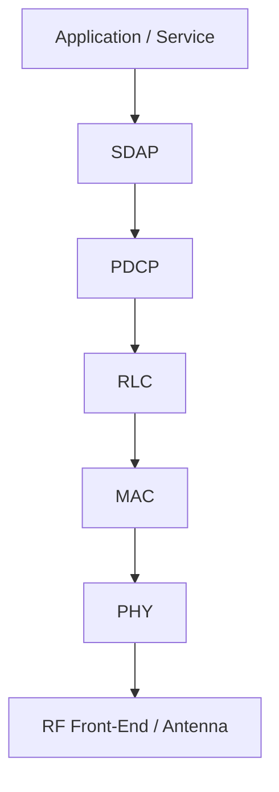
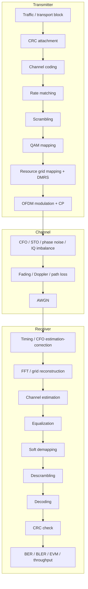
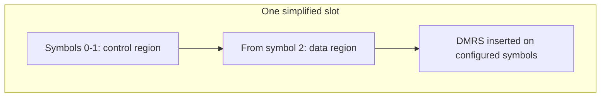
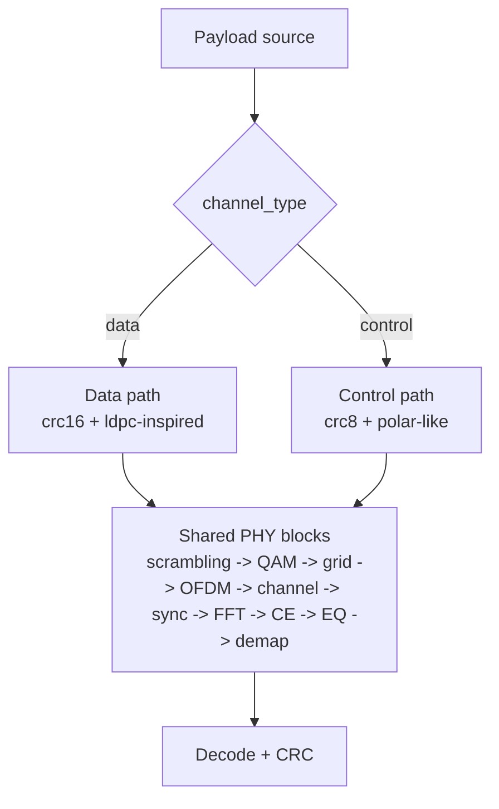

# TechDoc: 5G NR PHY theo huong truy vet chuoi xu ly va doi chieu voi PHY Pipeline cua du an

## 0. Muc dich tai lieu

Tai lieu nay mo ta 5G NR PHY theo mot cach phu hop voi cach du an hien tai da hien thuc va quan sat duoc trong GUI `PHY Pipeline`.

Muc tieu khong phai chi la nhac lai ly thuyet NR, ma la:

- dat chuoi PHY vao dung boi canh he thong 5G thuc te
- mo ta tung khoi PHY theo logic 3GPP
- chi ro khoi nao da duoc du an thuc thi
- chi ro khoi nao dang la simplified model
- giup nguoi doc co the mo GUI, bam vao tung block, va hieu block do dang lam gi theo ngon ngu cua 3GPP

Tai lieu nay nen duoc doc cung voi:

- [`README.md`](../README.md)
- [`docs/REAL_5G_SYSTEM_VS_PROJECT.md`](./REAL_5G_SYSTEM_VS_PROJECT.md)
- [`gui/phy_pipeline.py`](../gui/phy_pipeline.py)
- [`experiments/common.py`](../experiments/common.py)

## 1. Pham vi ky thuat

Tai lieu nay chi tap trung vao:

- **giao dien vo tuyen 5G NR**
- **chuoi PHY downlink**
- **control/data path o muc PHY**
- **channel, impairment, synchronization, estimation, equalization, demapping, decoding**

Tai lieu khong di sau vao:

- MAC scheduler day du/conformance-grade
- HARQ protocol loop day du o tang MAC
- RLC/PDCP/RRC/NAS
- 5G Core
- beam management/MIMO codebook chi tiet

Noi cach khac, day la TechDoc cho **NR PHY chain**, khong phai cho toan bo 5GS.

## 2. Neo tham chieu 3GPP

Khi doi chieu voi 3GPP, cac TS chinh can dung la:

| TS 3GPP | Vai tro chinh trong boi canh tai lieu nay |
| --- | --- |
| TS 38.300 | Overall NR / NG-RAN description |
| TS 38.211 | Physical channels and modulation |
| TS 38.212 | Multiplexing and channel coding |
| TS 38.213 | Physical layer procedures for control |
| TS 38.214 | Physical layer procedures for data |
| TS 38.104 | Base station radio requirements |
| TS 38.901 | Channel model for evaluation |

Cach doc dung:

- Neu tai lieu nay noi "3GPP-faithful", nghia la bam sat logic va ten goi cua cac TS tren.
- Neu tai lieu nay noi "simplified", nghia la du an giu **signal-flow logic** nhung khong giai bai toan theo dung tung chi tiet cua TS.

## 3. Vi tri cua PHY trong he thong 5G

Trong 5G thuc te:

- `MAC` quyet dinh scheduling, HARQ, grant, multiplexing theo thoi gian-tan so
- `PHY` thuc thi waveform-level processing
- `RF` dua waveform baseband len giao dien vo tuyen thuc

Trong du an nay:

- MAC day du khong ton tai
- co `P3` DCI-like grant replay va HARQ baseline duoc ghep vao link-level orchestration
- mot phan scheduler-like logic van duoc "nhung" trong `frame_structure` va `resource_grid`
- trong tam la **PHY waveform chain**

## 4. Tong quan chuoi PHY trong du an

### 4.1. Flow tong quat

```mermaid
flowchart LR
    A["Bits"] --> B["CRC"]
    B --> C["Coding"]
    C --> D["Rate Matching"]
    D --> E["Scrambling"]
    E --> F["QAM Mapping"]
    F --> G["Resource Grid + DMRS"]
    G --> H["OFDM / IFFT + CP"]
    H --> I["Channel / Impairments"]
    I --> J["Synchronization"]
    J --> K["FFT / OFDM Demodulation"]
    K --> L["Channel Estimation"]
    L --> M["Equalization"]
    M --> N["Soft Demapping"]
    N --> O["Decoding"]
    O --> P["CRC Check"]
    P --> Q["KPI"]
```

### 4.2. Flow TX-Channel-RX theo dung kien truc du an

## 5. Ban do anh xa: block GUI -> vai tro 3GPP -> ma nguon

| Stage trong GUI | Muc dich theo 3GPP | File chinh trong du an | Artifact GUI |
| --- | --- | --- | --- |
| `Bits` | transport payload / control payload | [`phy/transmitter.py`](../phy/transmitter.py) | payload bits |
| `CRC Attachment` | error detection before/after coding | [`phy/coding.py`](../phy/coding.py) | payload + CRC |
| `Channel Coding` | data/control protection | [`phy/coding.py`](../phy/coding.py) | mother codeword |
| `Rate Matching` | adapt coded bits to RE capacity | [`phy/coding.py`](../phy/coding.py) | rate-matched bits |
| `Scrambling` | whiten bitstream, avoid structure | [`phy/scrambling.py`](../phy/scrambling.py) | scrambled bits, sequence |
| `QAM Mapping` | map bits to constellation points | [`phy/modulation.py`](../phy/modulation.py) | mapping table, constellation |
| `VRB -> PRB Mapping` | translate scheduled virtual RBs into physical RB/subcarrier allocation | [`phy/vrb_mapping.py`](../phy/vrb_mapping.py), [`phy/resource_grid.py`](../phy/resource_grid.py) | VRB mask, VRB-to-PRB table |
| `Resource Grid + DMRS` | place data/control/pilot on REs | [`phy/resource_grid.py`](../phy/resource_grid.py), [`phy/dmrs.py`](../phy/dmrs.py) | allocation map, DMRS mask |
| `OFDM / IFFT + CP` | convert grid to waveform | [`phy/transmitter.py`](../phy/transmitter.py) | TX waveform, spectrum |
| `Channel / Impairments` | propagation + RF impairments | [`channel/*`](../channel) | impulse/frequency response |
| `Synchronization` | timing + CFO estimation/correction | [`phy/synchronization.py`](../phy/synchronization.py) | timing metric, CFO trace |
| `FFT / OFDM Demodulation` | rebuild RX grid | [`phy/receiver.py`](../phy/receiver.py) | RX grid |
| `Channel Estimation` | estimate H on scheduled REs | [`phy/channel_estimation.py`](../phy/channel_estimation.py) | estimated channel grid |
| `Equalization` | compensate channel distortion | [`phy/equalization.py`](../phy/equalization.py) | pre/post-EQ constellation |
| `Soft Demapping` | produce LLRs | [`phy/modulation.py`](../phy/modulation.py) | LLR trace, histogram |
| `Decoding` | recover protected payload | [`phy/coding.py`](../phy/coding.py) | recovered bits |
| `CRC Check` | final block validation | [`phy/coding.py`](../phy/coding.py), [`phy/kpi.py`](../phy/kpi.py) | CRC decision, KPI bar |

## 6. TX chain: chi tiet tung khoi

## 6.1. Traffic / transport block

### Ly thuyet 3GPP

Downlink PHY khong lam viec truc tiep voi "application packet" ma voi **transport block** do MAC giao xuong. Trong NR that:

- kich thuoc TB phu thuoc MCS, allocated REs, số layer, overhead va scheduler decision
- control path va data path co co che bao ve khac nhau

### Du an hien tai

Du an sinh payload truc tiep trong [`phy/transmitter.py`](../phy/transmitter.py):

- `transport_block.size_bits` cho data path
- `control_channel.payload_bits` cho control path

Mac dinh:

- data payload: `1024 bits`
- control payload: `128 bits`

### Dau vao / dau ra

| Dau vao | Dau ra |
| --- | --- |
| cau hinh `channel_type`, payload size, RNG seed | vector bit `payload_bits` |

### Gia tri hoc thuat

Khoi nay cho phep tach bai toan PHY khoi protocol stack. Day la mot simplification hop ly cho mo phong link-level.

## 6.2. CRC attachment

### Ly thuyet 3GPP

Trong NR that:

- data path dung TB CRC, sau do co the them CB CRC sau segmentation
- control path dung CRC nho hon tuy procedure
- CRC la co che error detection, khong phai error correction

### Du an hien tai

Trong [`phy/coding.py`](../phy/coding.py):

- data path dung `crc16`
- control path dung `crc8`
- ham chinh: `attach_crc()` va `check_crc()`

### Dau vao / dau ra

`payload_bits -> payload_with_crc`

### Khac biet so voi 3GPP that

- khong co TB CRC 24-bit/CB CRC theo cach chia code block cua NR
- khong co segmentation

### Artifact GUI

- `Payload + CRC`
- metric: `CRC type`, `Payload bits`, `Protected length`

## 6.3. Channel coding

### Ly thuyet 3GPP

Trong NR:

- data channel dung **QC-LDPC**
- control channel dung **Polar coding**
- coding la co che chinh de day reliability cua link

### Du an hien tai

Trong [`phy/coding.py`](../phy/coding.py):

- `NrLdpcInspiredCoder`
  - khong phai QC-LDPC that
  - su dung repetition + interleaver + circular buffer logic
- `PolarLikeControlCoder`
  - co reliability ordering va polar transform co ban
  - decode bang SC decoder don gian

### Danh gia ky thuat

Du an da dung **kien truc logic**:

- data va control dung hai family coder khac nhau
- coder output ra mother codeword
- decoder nhan LLR o receiver

Nhung du an chua dung:

- base graph selection
- lifting size
- code block segmentation
- dung polar construction, interleaving va rate matching cua NR

### Artifact GUI

- `Mother codeword`
- metrics: coder type, mother length, RV, control/data mode

## 6.4. Rate matching

### Ly thuyet 3GPP

Rate matching trong NR that quyet dinh cach:

- puncture
- repeat
- shorten
- map theo circular buffer
- ho tro RV cho HARQ retransmission

### Du an hien tai

Rate matching duoc thuc thi bang:

- `_circular_rate_match()`
- `_circular_rate_recover()`

Logic:

- chon bit theo circular buffer
- co metadata `redundancy_version`
- receiver cong don LLR ve mother length

### Diem dung

- giu dung y tuong "adapt coded bits to exact RE capacity"
- giu scaffolding cho `rv`

### Diem chua du

- co HARQ loop baseline cho P3: process state, NDI, RV va rate-recovered LLR soft combining
- chua co real puncturing/shortening pattern bit-true nhu 3GPP

## 6.5. Scrambling

### Ly thuyet 3GPP

Scrambling trong NR dung de:

- whiten chuoi bit
- giam tinh cau truc quang pho
- tach biet sequence theo cell/user/process context

Thuong no dua tren Gold sequence va `cinit` duoc tao tu cell ID, RNTI, q, slot...

### Du an hien tai

Trong [`phy/scrambling.py`](../phy/scrambling.py):

- co `nid`
- co `rnti`
- co tham so `q`
  - `q = 0` cho data
  - `q = 1` cho control

Day la mot diem rat dung logic 3GPP.

### Artifact GUI

- `Scrambled bits`
- `Scrambling sequence`

## 6.6. QAM mapping

### Ly thuyet 3GPP

NR ho tro:

- QPSK
- 16QAM
- 64QAM
- 256QAM

Mapping thuong dung Gray labeling de giam bit error khi co nearest-neighbor decision error.

### Du an hien tai

Trong [`phy/modulation.py`](../phy/modulation.py):

- `bits_per_symbol()`
- `constellation_table()`
- `ModulationMapper.map_bits()`
- `ModulationMapper.demap_llr()`

Ho tro day du:

- `QPSK`
- `16QAM`
- `64QAM`
- `256QAM`

### Demapping

Receiver dung:

- max-log style soft demapping
- xuat LLR cho decoder

### Artifact GUI

- `Mapping table`
- `Constellation before/after channel`
- pre-EQ va post-EQ compare

## 6.7. Resource grid mapping

### Ly thuyet 3GPP

NR trien khai time-frequency resource grid theo:

- subcarrier
- OFDM symbol
- slot
- BWP / PRB / RE

Control va data khong map giong nhau:

- PDCCH nam trong CORESET/SearchSpace
- PDSCH nam trong allocated PRB/RE va phai tranh pilot/reference signal

### Du an hien tai

Trong [`phy/resource_grid.py`](../phy/resource_grid.py):

- `pdcch_positions()`
- `pdsch_positions()`
- `dmrs_positions()`
- `mapping_for()`

Trong [`phy/frame_structure.py`](../phy/frame_structure.py):

- `control_symbols`
- `pdsch_start_symbol`
- `dmrs_symbols`
- `control_subcarriers`

Default config:

- `control_symbols = 2`
- `pdsch_start_symbol = 2`
- `dmrs_symbols = [3, 10]`
- `control_subcarriers = 72`

Baseline `VRB -> PRB` trong [`phy/vrb_mapping.py`](../phy/vrb_mapping.py):

- `mapping_type = non_interleaved`: VRB duoc anh xa truc tiep sang PRB trong BWP
- `mapping_type = interleaved`: mo hinh teaching de minh hoa distributed allocation
- `bwp_size_prb = 0` nghia la tu dong dung phan bandwidth con lai
- `num_vrbs = 0` nghia la tu dong cap phat tu `start_vrb` den cuoi BWP
- mapping nay dang dieu khien PDSCH/PUSCH data RE va DMRS/PT-RS lien quan den data allocation

### Mermaids cho allocation logic

### Diem manh

- du an lam ro khong gian thoi gian-tan so
- du lieu va pilot duoc tach ro
- GUI hien heatmap allocation rat de day hoc

### Diem chua du

- khong co CORESET/SearchSpace dung nghia
- co baseline `VRB -> PRB` cho PDSCH/PUSCH, nhung chua day du DCI RIV/RBG/interleaver theo tat ca procedure 3GPP
- khong co CSI-RS, PT-RS, PTRS

## 6.8. DMRS insertion

### Ly thuyet 3GPP

DMRS la pilot embedded trong allocation de:

- estimate channel
- phuc vu equalization
- trong mot so context phuc vu tracking

Pattern DMRS trong NR phu thuoc:

- channel type
- mapping type
- number of symbols
- ports/layers
- additional positions

### Du an hien tai

Trong [`phy/dmrs.py`](../phy/dmrs.py):

- sequence tao tu Gold sequence
- pattern `comb-2`
- offset phu thuoc `(slot + dmrs_symbol) & 1`

Trong [`phy/resource_grid.py`](../phy/resource_grid.py):

- DMRS duoc chen vao grid tai cac RE duoc pattern quyet dinh

### Diem dung

- dung vai tro cua DMRS trong estimation
- dung tu duy "pilot xen trong data region"

### Diem don gian hoa

- single-port mindset
- khong mo ta mapping type A/B dung nghia
- khong co additional DMRS positions nhu NR that

## 6.9. OFDM / IFFT + CP

### Ly thuyet 3GPP

NR PHY downlink dua tren CP-OFDM:

- IFFT bien grid tan so thanh waveform thoi gian
- chen cyclic prefix de giam ISI va giup frequency-domain equalization

### Du an hien tai

Trong [`phy/transmitter.py`](../phy/transmitter.py):

- `active_to_ifft_bins()`
- `np.fft.ifft()`
- cat va chen `cp`

Trong [`phy/numerology.py`](../phy/numerology.py):

- `sample_rate = fft_size * subcarrier_spacing`
- `symbols_per_slot = 14`

### Nhan xet quan trong

Du an dung logic OFDM rat ro rang va de nghien cuu. Tuy nhien:

- CP length duoc config co dinh
- slots/frame mac dinh chua bam het quy tac `10 x 2^mu`

## 7. Channel va RF impairments

## 7.1. RF/baseband impairments

### Ly thuyet

Truoc khi toi receiver, waveform co the bi:

- carrier frequency offset
- symbol timing offset
- phase noise
- IQ imbalance

### Du an hien tai

Trong [`channel/impairments.py`](../channel/impairments.py):

- `apply_cfo()`
- `apply_sto()`
- `apply_phase_noise()`
- `apply_iq_imbalance()`

Logic nay rat phu hop cho teaching vi tung impairment duoc tach rieng va co tham so doc lap.

## 7.2. Fading, Doppler, path loss

### Ly thuyet

Kenh vo tuyen thuc te khong chi co nhieu AWGN ma con co:

- multipath
- frequency selectivity
- time selectivity
- large-scale loss
- shadowing

### Du an hien tai

Trong [`channel/fading_channel.py`](../channel/fading_channel.py) va [`channel/tapped_delay_line.py`](../channel/tapped_delay_line.py):

- co profile:
  - `static_near`
  - `cell_edge`
  - `pedestrian`
  - `vehicular`
  - `indoor`
  - `urban_los`
  - `urban_nlos`
  - `severe_fading`
- ho tro:
  - Rayleigh
  - Rician
  - delay spread scaling
  - Doppler rotation
  - path loss + free-space loss + shadowing

### Danh gia

Day la mot trong nhung phan mo phong duoc lam rat tot cua du an trong boi canh teaching/research.

## 7.3. AWGN

AWGN duoc thuc thi rieng trong [`channel/awgn_channel.py`](../channel/awgn_channel.py).

No dong vai tro:

- baseline reference channel
- thanh phan noise cuoi cung sau fading/impairments
- input chinh cho cac BER/BLER/EVM sweeps

## 8. RX chain: chi tiet tung khoi

## 8.1. Synchronization

### Ly thuyet 3GPP

Receiver OFDM phai:

- tim dung symbol boundary
- estimate / correct CFO
- dua waveform ve che do phu hop de FFT

Trong he thong NR that, synchronization con gan voi:

- cell search
- SSB/PBCH acquisition
- tracking trong qua trinh connected mode

### Du an hien tai

Trong [`phy/synchronization.py`](../phy/synchronization.py):

- `estimate_symbol_timing()`
  - dua tren CP correlation
- `estimate_cfo_from_cp()`
  - dua tren pha giua CP va phan cuoi symbol
- `correct_cfo()`

### Diem dung

- rat sat logic OFDM receiver co ban
- cho thay ro vi sao CP giup timing/CFO

### Diem chua du

- chua co initial access day du
- chua co tracking loop hay multi-stage sync

### Artifact GUI

- timing metric
- CFO estimation trace
- corrected waveform

## 8.2. FFT / OFDM demodulation

Sau sync, receiver:

1. cat tung block OFDM
2. bo CP
3. FFT
4. map ve active subcarriers

Trong [`phy/receiver.py`](../phy/receiver.py), ham `_ofdm_demodulate()` lam ro tung buoc nay.

Artifact GUI:

- `RX grid magnitude`
- `RX spectrum`

## 8.3. Channel estimation

### Ly thuyet 3GPP

UE phai estimate `H(k, n)` tren grid:

- theo tan so
- theo thoi gian
- dua tren DMRS / pilot structure

### Du an hien tai

Trong [`phy/channel_estimation.py`](../phy/channel_estimation.py):

- LS estimate tren RE co DMRS
- noi suy tuyen tinh theo tan so
- noi suy tuyen tinh theo thoi gian

Output:

- `h_dmrs`
- `h_full`

### Diem dung

- dung logic pilot-based CE
- phu hop de mo ta metric `channel_estimation_mse`

### Diem don gian hoa

- interpolation don gian
- khong co denoising, Wiener filtering, 2D advanced interpolation
- khong co DMRS port/layer complexity

## 8.4. Equalization

### Ly thuyet

Equalizer co muc dich:

- bu amplitude/phase distortion
- dua symbol ve gan reference constellation point

Hai mode pho bien:

- ZF
- MMSE

### Du an hien tai

Trong [`phy/equalization.py`](../phy/equalization.py):

- `zf`
- `mmse`

MMSE duoc tinh theo:

- `conj(H) * Y / (|H|^2 + noise_variance)`

### Artifact GUI

- pre-EQ constellation
- post-EQ constellation
- equalizer gain

## 8.5. Soft demapping

### Ly thuyet

Decoder hien dai can **soft information**, khong chi hard bits.

LLR cho biet:

- bit `0` hay `1` nao co kha nang cao hon
- muc do tin cay cua quyet dinh

### Du an hien tai

Trong [`phy/modulation.py`](../phy/modulation.py):

- `demap_llr()`
- max-log style metric

Artifact GUI:

- `LLR trace`
- `LLR histogram`

## 8.6. Descrambling

Sau demapping, LLR phai duoc dua qua descrambling de:

- tra sequence ve logic cua coded bit ban dau
- dong bo voi sequence da duoc phat

Du an thuc thi buoc nay trong:

- [`phy/scrambling.py`](../phy/scrambling.py)
- receiver dung `descramble_llrs()`

### Ghi chu ve GUI

Trong phien ban GUI hien tai, `descrambling` khong duoc tach thanh mot block click rieng. No duoc xu ly nhu mot **sub-step noi bo** nam giua:

- `Soft Demapping`
- `Decoding`

Viec tach rieng muc nay trong TechDoc la co chu dich, vi ve mat ly thuyet PHY va luong xu ly receiver, day van la mot buoc logic can duoc nhan dien ro rang.

## 8.7. Decoding

### Ly thuyet

Decoder co vai tro:

- khai thac redundancy cua code
- quyet dinh bit payload

Trong NR that:

- data: LDPC decode
- control: Polar decode

### Du an hien tai

Receiver goi lai dung family coder da duoc build o TX:

- data -> `NrLdpcInspiredCoder.decode()`
- control -> `PolarLikeControlCoder.decode()`

### Diem dung

- luong decode da la soft-input
- data/control dung hai bo decoder rieng

### Diem chua du

- khong phai LDPC/Polar dung 3GPP

Artifact GUI:

- recovered bits
- bit error mask

## 8.8. CRC check

### Ly thuyet

Day la buoc quyet dinh:

- block decode thanh cong hay that bai
- BLER = 0 hay 1 cho moi block

### Du an hien tai

CRC check duoc thuc thi trong [`phy/coding.py`](../phy/coding.py), sau do KPI tong hop o [`phy/kpi.py`](../phy/kpi.py).

Artifact GUI:

- CRC decision
- KPI summary bar

## 9. KPI layer

Du an tinh:

- BER
- BLER
- EVM
- throughput
- spectral efficiency
- estimated SNR
- channel estimation MSE
- synchronization error

Cong thuc trien khai nam trong [`phy/kpi.py`](../phy/kpi.py).

### Y nghia tung KPI

| KPI | Y nghia |
| --- | --- |
| BER | ti le bit sai sau decode |
| BLER | block co qua CRC hay khong |
| EVM | chat luong symbol sau equalization |
| Throughput | so bit decode dung tren don vi thoi gian slot |
| Spectral efficiency | throughput / bandwidth |
| Estimated SNR | SNR sau equalization theo tham chieu symbol |
| CE MSE | do lech giua estimate va reference channel |
| Sync error | sai lech timing so voi state tham chieu |

## 10. Data path va control path: diem giong va diem khac

### Giong nhau

- deu qua scrambling, modulation, grid mapping, OFDM, channel, sync, FFT, CE, EQ, demap

### Khac nhau

- control payload ngan hon
- control coder va CRC khac
- control resource placement o `control region`
- data placement o `pdsch region`

## 11. Nhung diem ma du an bam sat 3GPP rat tot

1. Tach rieng data/control path
2. Co DMRS va CE/EQ dung logic PHY
3. Ho tro multiple QAM orders
4. OFDM numerology va resource-grid abstraction ro rang
5. Co fading, Doppler, path loss, CFO, STO, phase noise, IQ imbalance
6. GUI truy vet tung stage dung ngon ngu cua PHY

## 12. Nhung diem simplified can hieu dung

1. `LDPC-inspired` khong phai QC-LDPC
2. `polar-like` khong phai NR polar coding day du
3. rate matching chi giu y tuong circular buffer
4. HARQ moi o muc baseline, chua phai MAC HARQ conformance-grade
5. layer mapping / precoding / beamforming moi o muc SU-MIMO baseline
6. CSI-RS / PT-RS / SRS moi o muc observability/reference-signal baseline
7. frame timing chua fully numerology-dependent
8. SSB/PBCH initial access moi o muc baseline, chua day du procedure

## 13. Cach doc GUI `PHY Pipeline` nhu mot ky su PHY

Khuyen nghi trinh tu:

1. Bat dau o `Bits`
2. Kiem tra `CRC` va `Channel Coding`
3. Xem `Rate Matching` co phu hop RE capacity khong
4. Xem `QAM Mapping` de hieu modulation order
5. Xem `Resource Grid + DMRS` de biet RE nao mang data, RE nao mang pilot
6. Xem `OFDM / IFFT + CP` de thay waveform
7. Xem `Channel / Impairments` de thay waveform bi bien doi ra sao
8. Xem `Synchronization` de danh gia timing/CFO recovery
9. Xem `Channel Estimation` va `Equalization` de hieu tai sao constellation duoc "keo ve"
10. Xem `Soft Demapping`, `Decoding`, `CRC Check` de noi ket noise/channel voi BER/BLER

## 14. Placeholder nen bo sung neu ban muon nang cap thanh bo TechDocs hoan chinh hon

> [PLACEHOLDER-FIG-PHY-1]
> Screenshot tab `PHY Pipeline` o baseline AWGN.

> [PLACEHOLDER-FIG-PHY-2]
> Screenshot tab `PHY Pipeline` o vehicular stress scenario.

> [PLACEHOLDER-FIG-PHY-3]
> Hinh ve allocation map co control/data/DMRS.

> [PLACEHOLDER-FIG-PHY-4]
> Hinh ve pre-EQ va post-EQ constellation o 3 muc SNR.

> [PLACEHOLDER-TABLE-PHY-1]
> Bang trace mot frame demo: kich thuoc bitstream qua tung stage.

> [PLACEHOLDER-TABLE-PHY-2]
> Bang doi chieu chi tiet giua implementation hien tai va TS 38.211/38.212/38.214 theo tung feature item.

## 15. Ket luan

Neu doc du an nay theo dung goc nhin 3GPP, ta co the dinh vi no nhu sau:

- Day la mot **NR-inspired, software-only, downlink-centric PHY tracing platform**
- No manh o **signal-flow transparency**
- No rat hop cho **teaching, lab work, va nghien cuu giai thuat**
- No chua phai **standard-faithful PHY simulator**
- No cang khong phai **end-to-end 5G stack**

Tuy nhien, voi muc tieu "truy vet chuoi PHY", du an hien tai da lam dung mot dieu rat kho:

> no bien chuoi NR PHY tu mot dong ly thuyet trong 3GPP thanh mot he thong co the bam tung block, xem tung artifact, va noi duoc tung artifact do voi KPI cuoi cung.
